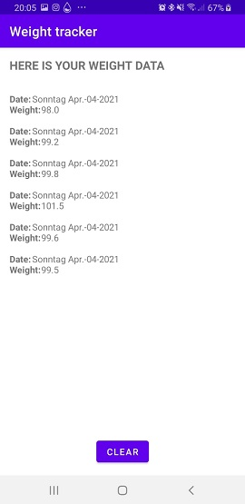

# Weighttracker
App for tracking weight changes over time.

## I made this App for two reasons: 
- Firstly, I am on a diet and I implemented the way I like to track my weight.
- Secondly, I used this project to get familiar with Kotlin and the Android SDK.

## The way the app works:

 

Once a day the user puts his weight into the app, the average weight of the last 7 days gets calculated and shown.  
The reason for this is, that, in my opinion, tracking weight is best with using average values, since weight tends to rise and fall on a day to day basis.  
 
I will implement a Goal functionality, which lets the user set a goal. When said goal is reached, the user gets a notification and the possibility to share this milestone.
